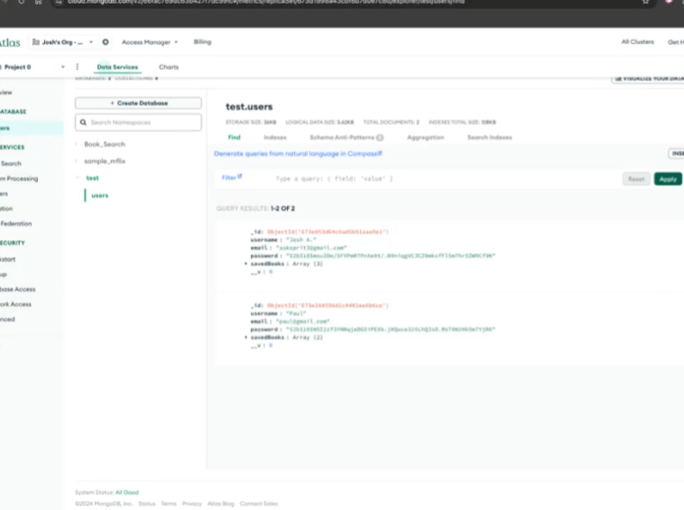
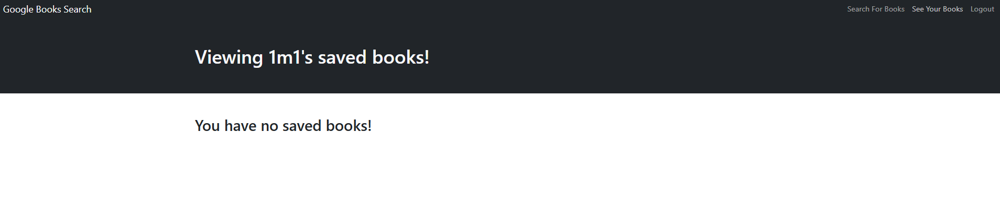

# Book Search Engine

  
 

Link to deployed Site 

https://booksearchengine-5ikq.onrender.com

## Description 

This project is a google books search engine that uses JWT authentication to log in a user and allow them to search for books and save to their own database using a graphql api

## Table of Contents  

[Project](#Book Search Engine)

[Description](#description)

[Table of Contents](#table-of-contents)

[Installation](#installation)

[Usage](#usage)

[License](#license)

[Contributing](#contributing)

[Tests](#tests)

[Questions](#questions)

  ## Installation  

    npm run build
    npm develop

   

  ## Usage  

    n/a

  ## License 

  This application is covered under the following license:  

   

  [![License: MIT]] (https://opensource.org/licenses/MIT) 

   

  ## Contributing  

  n/a 

   

  ## Tests  

    Make sure user can log in
    Make sure books can be searched
    Make sure books can be saved
    Make sure books can be deleted

   
  ## Questions 

  Githubname: TheReal4m4d3u5

   

  https://github.com/TheReal4m4d3u5 

   

  averyajacobson@gmail.com 

